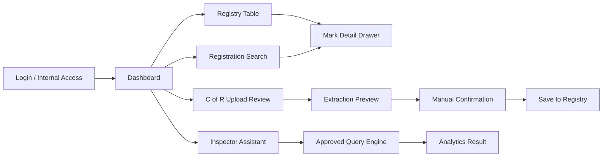
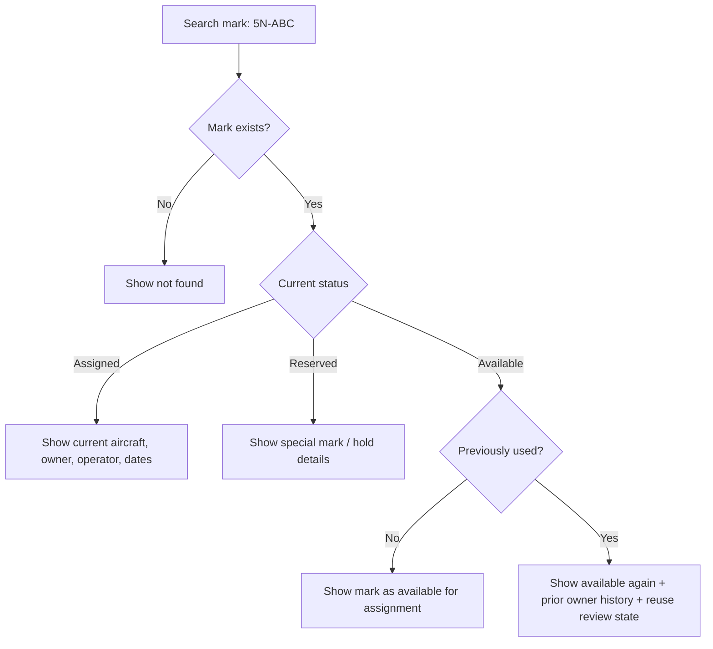
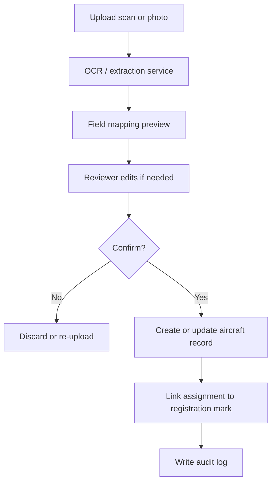
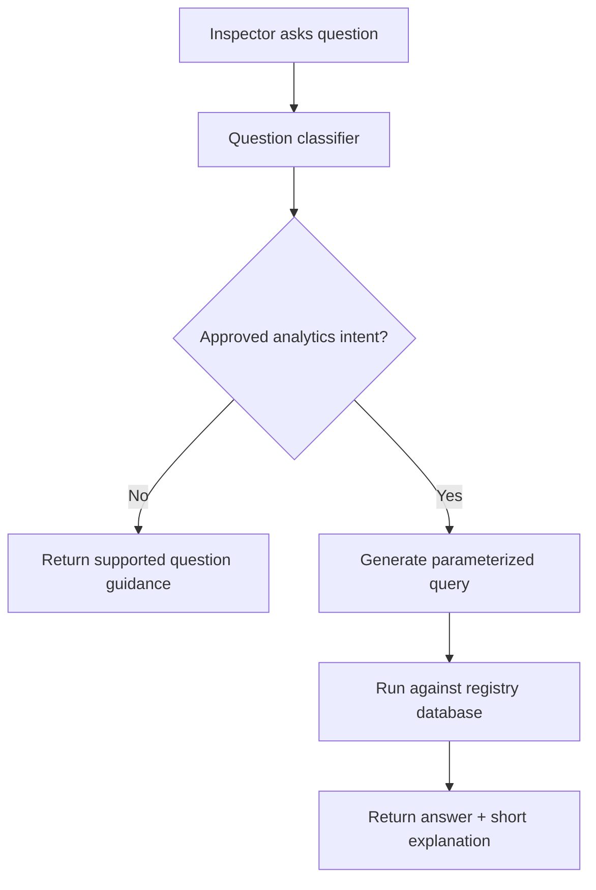
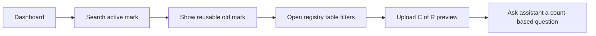

# App Flow Document

This document uses Mermaid so you can preview the flows directly in VS Code with Markdown preview.

## High-Level Navigation

## Registration Search and Reuse Flow

## C of R Upload Flow

## Inspector Assistant Flow

## Screen-Level Flow for the Demo

## Notes

- For the demo, keep the app as a single internal tool with tabbed pages.
- For production, split the registry, upload, analytics, and assistant into clear backend services behind one UI.
- The assistant should only answer from approved query templates until the data quality is stable.
